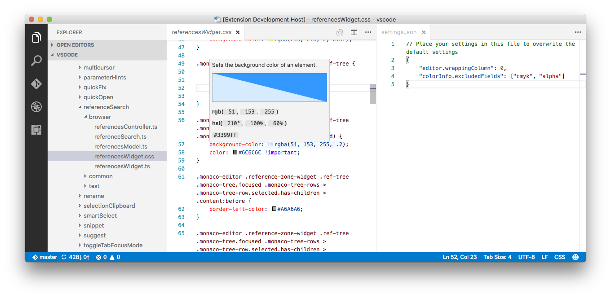

# VSCode Color Info

[Visual Studio Code](https://code.visualstudio.com) extension that provides quick information css colors.


## About
*Color Info* adds additional information when you hover over a css color, including:

* `rgb` – RGB color values. Enabled by default
* `hsl` – HSL color values. Enabled by default
* `hsv` – HSV color values
* `lab` – LAB color values
* `cmyk` – CMYK color values. Enabled by default
* `hex` – Hex value. Enabled by default
* `alpha` – Alpha value. Enabled by default
* `preview` – Preview of the color. Displays color with alpha in lower left coner and color without alpha in upper right corner. Enabled by default
* `preview-xl` – Larger preview of the color
* `preview-square-xl` – Square preview of the color
* `preview-square-xl` – Larger square preview of the color

You can customize which of these fields are displayed and the order they are displayed in using the settings described below.

By default, the extension works with any css, sass, or less document and recognizes all basic css color formats, including named colors. You can also enable Color Info in additional file types using the `colorInfo.languages` setting


## Configuration

#### `colorInfo.fields`
Ordered array of color fields to display.


#### `colorInfo.excludedFields`
Array of fields not to display. Overrides `colorInfo.fields`. If you only need to exclude one or two of the default fields, using `colorInfo.excludedFields` is the preferred approach.




#### `colorInfo.languages`
An array that defines files and languages that have color info enabled, and which color types are supported for each one. Each element of the languages array is:

* `"selector"` - [VSCode document selector](https://code.visualstudio.com/Docs/extensionAPI/vscode-api#DocumentSelector).
* `"colors"` - Defines the types of colors to display information for. Valid values are:

    * `css` - All css color value types
    * `hex` - Css hex (`#ff0ff`) color value
    * `rgb` - Css rgb (`rgb(1, 2, 3)`) color values
    * `hsl` - Css hsl (`hsl(1, 2, 3)`) color values
    * `css-colors-names` - Css color names (`red`, `blue`)

The default language setting enables all css color values for `css`, `sass`, and `less` documents:

```json
"colorInfo.languages": [
    {
        "selector": "css",
        "colors": "css"
    }, {
        "selector": "sass",
        "colors": "css"
    }, {
        "selector": "less",
        "colors": "css"
    }
]
```

VSCode does not currently support nested languages, so to enable Color Info in an html file, you must add: 

```json
{
    "selector": "html",
    "colors": "css"
}
```

To your `colorInfo.languages` setting.